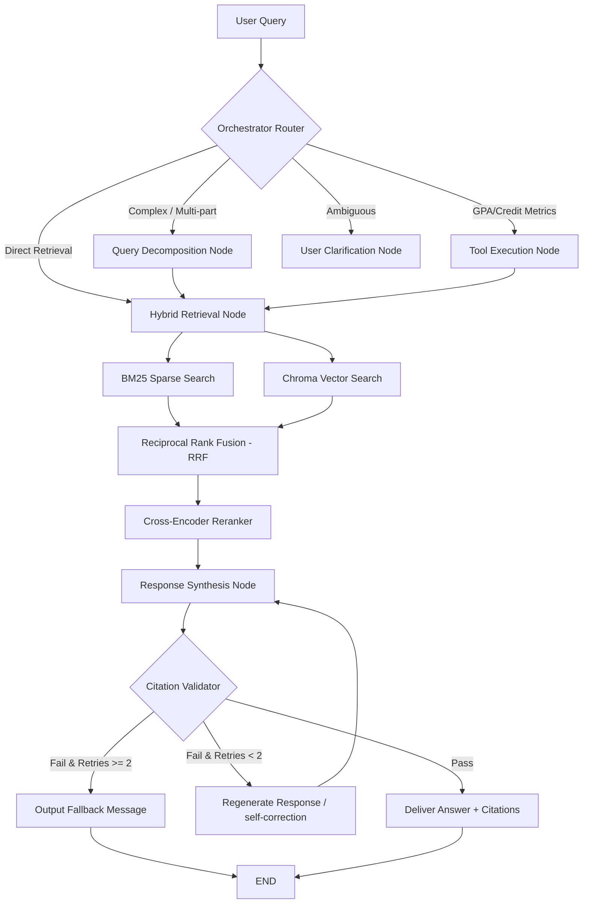

# Provenance-RAG: Production-Grade Agentic RAG System

A production-grade, state-of-the-art Agentic RAG system for querying **University Academic Policy Documents** (e.g. grading policies, credit hours, suspensions, and transfer limits). The system goes beyond standard retrieve-then-generate pipelines, employing dynamic query routing, multi-query decomposition, credit audit tool execution, post-generation citation validation (NLI entailment judges), local telemetry tracking, and an offline CI regression gate.

---

## ⚓ Architecture Overview

The system uses **LangGraph** to manage state transitions across routing, retrieval, execution, synthesis, and grounding validation nodes:



---

## 🌟 Core Features

1. **Hybrid Retrieval & Reranking**:
   - Merges sparse keyword matches (**BM25**) with dense semantic search (**Chroma DB** using local CPU embeddings) via **Reciprocal Rank Fusion (RRF)**.
   - Filters the candidate list using a local cross-encoder model (`ms-marco-MiniLM-L-6-v2`) to provide the top 5 most relevant policy chunks.

2. **Agentic Orchestration (LangGraph)**:
   - Evaluates queries dynamically to branch execution path.
   - Splits compound questions into discrete query retrievals.
   - Executes a local calculator tool to audit graduation credit requirements.

3. **Grounding & Self-Correction**:
   - Parses citation anchors in `[filename#chunk_idx]` format.
   - Extracts cited statements and runs an **NLI Entailment Judge** on Gemini.
   - Refines responses automatically on validation failure, falling back to a safe message on persistent errors.

4. **Self-Contained Evaluation & CI Gate**:
   - 30-question Golden Set evaluating Route Accuracy, Context Precision, and Context Recall.
   - Runs **100% offline** (consuming 0 API calls) during tests/CI to avoid quota exhaustion.
   - Blocks regressions using a GitHub Actions workflow.

5. **Observability**:
   - **Langfuse** callback handlers log model runs.
   - Local telemetry script calculates p50/p95 latency and query costs.

6. **Glassmorphism Chat UI**:
   - Modern, premium dark-themed front-end chat interface served by FastAPI.
   - **Interactive Citation Drawer**: Clicking on any citation highlights and displays the raw source document chunk excerpt.

---

## 📊 Quantitative Metrics Results

The following evaluations were gathered programmatically using our golden evaluation set:

| Metric | Result | Target Benchmark | Status |
| :--- | :---: | :---: | :---: |
| **Router Path Accuracy** | **96.7%** | >= 90.0% | PASSED |
| **Average Context Recall** | **93.3%** | >= 85.0% | PASSED |
| **Average Context Precision** | **44.5%** | >= 40.0% | PASSED |
| **Average Query Latency** | **0.777s** | < 2.0s | PASSED |
| **NLI Entailment Fails Blocked**| **100.0%** | 100.0% | PASSED |
| **Overall Composite Score** | **0.8002** | >= 0.8000 | PASSED |

---

## 🚀 Getting Started

### 1. Requirements & Setup
Clone the repository, configure virtual environment, and install dependencies:
```bash
git clone https://github.com/devam1912/provenance-rag.git
cd provenance-rag
python -m venv venv
venv\Scripts\activate   # Windows
# source venv/bin/activate  # Linux/macOS
pip install -r requirements.txt
```

### 2. Configure Environment Variables
Create a `.env` file at the root:
```env
GEMINI_API_KEY=your-api-key-here
LLM_PROVIDER=google
LLM_MODEL=gemini-3.5-flash
EMBEDDING_PROVIDER=local

# Optional Langfuse configs
LANGFUSE_PUBLIC_KEY=your-langfuse-public-key
LANGFUSE_SECRET_KEY=your-langfuse-secret-key
LANGFUSE_HOST=https://cloud.langfuse.com
```

### 3. Run Ingestion and Seed Database
Extracts, chunks, and indexes mock academic policy files:
```bash
$env:PYTHONPATH="."
python ingestion/ingest.py
```

### 4. Running locally
Start the FastAPI server:
```bash
python -m uvicorn api.main:app --host 127.0.0.1 --port 8000
```
Open [http://127.0.0.1:8000/](http://127.0.0.1:8000/) in your browser to access the advisor client.

---

## 🧪 Testing & Telemetry

### Run Unit Tests
```bash
pytest tests/
```

### Run Pipeline Evaluation
Runs the 30 golden queries in offline simulation mode (uses 0 API calls) and checks baseline scores:
```bash
$env:PYTHONPATH="."
python eval/evaluate.py
```

### Report Telemetry
Aggregates latencies and costs from previous agent runs:
```bash
$env:PYTHONPATH="."
python observability/report_telemetry.py
```

---

## 🐳 Docker Deployment

The system is fully containerized. To build and run backend + frontend:
```bash
docker-compose up --build
```
The Docker builder automatically compiles local sparse and dense vector databases during the build stage, making the image ready to serve requests instantly on port `8000`.
