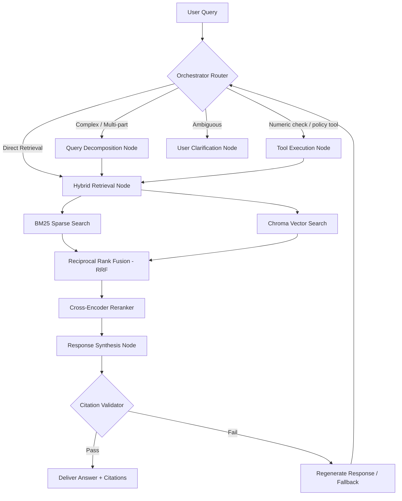

# System Architecture: Agentic RAG

This document outlines the architecture and data flow of the production-grade Agentic RAG system for **University Academic Policy Documents**.

---

## System Overview

---

## Key Components

1.  **Ingestion & Indexing Pipeline (`/ingestion`)**
    *   **Document Loaders**: Read text, PDF, and JSON academic policies.
    *   **Semantic / Section Chunker**: Chunks text by preserving logical headers (e.g. "Section 2.1 - Academic Standing") and appends a permanent source chunk ID (`doc_name#chunk_idx`).
    *   **Dual Indexing**:
        *   **Vector Index**: Embedded using a dense model (local sentence-transformers or OpenAI) and indexed in Chroma.
        *   **Sparse Index**: Indexed using BM25 for keyword accuracy (matching terms like "GPA", specific course codes like "CS101", etc.).

2.  **Hybrid Retrieval & Reranking (`/retrieval`)**
    *   **Reciprocal Rank Fusion (RRF)**: Merges rank lists from BM25 and vector stores mathematically to avoid normalization issues.
    *   **Rerank Stage**: Uses a cross-encoder model (`bge-reranker-base`) to evaluate semantic relevance of candidate chunks relative to the query, filtering down to top 5-8 chunks.

3.  **Agentic Orchestration (`/agent`)**
    *   Powered by **LangGraph**. Maintains a persistent state containing the user query, chat history, retrieved chunks, proposed claims, and final response.
    *   **Router**: Dynamically evaluates the user query and routes to the appropriate path.
    *   **Sub-question Generator**: Decomposes compound queries (e.g. "Can I transfer credits from external college and what GPA do I need to stay on active status?") into independent retrieval runs.

4.  **Citation Validator (`/grounding`)**
    *   Extracts citations from the synthesized answer (e.g., `[academic_standing.txt#chunk_4]`).
    *   Verifies:
        1. The chunk ID is present in the retrieved set.
        2. The referenced statement is semantically and factually supported by the raw text of that chunk.
    *   Triggers self-correction or returns "insufficient information" on failure.

5.  **Observability & Evaluator (`/observability`, `/eval`)**
    *   **Tracing**: Deep tracing of each graph transition, retrieval speed, token consumption, and cost via **Langfuse**.
    *   **Evaluator**: Scores responses on Faithfulness, Answer Relevancy, and Context Precision/Recall against a golden set of questions. Run in CI via GitHub Actions.
